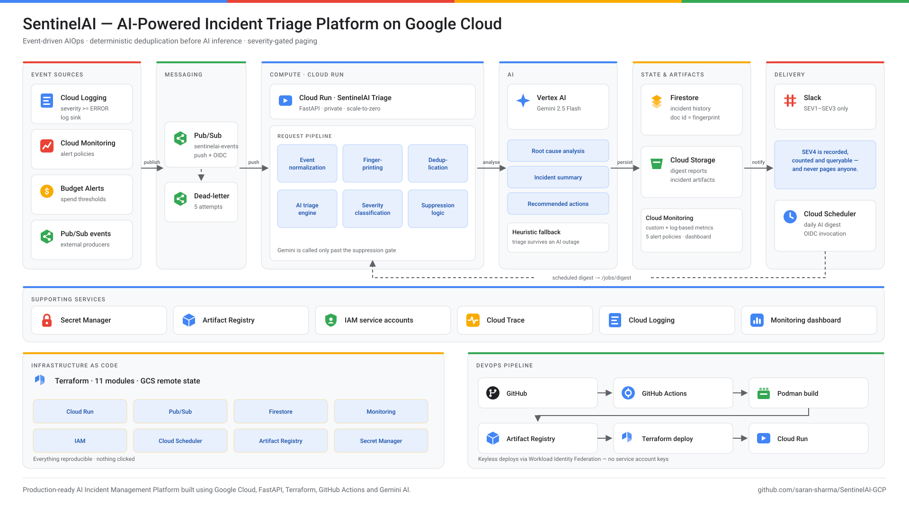

# SentinelAI — AI-Powered Incident Triage & Alert Noise Suppression on GCP

> An event-driven AIOps platform that ingests production signals from Cloud Logging,
> Cloud Monitoring and Cloud Billing, collapses them into deduplicated incidents,
> and uses **Vertex AI (Gemini)** to produce a severity, a probable root cause and a
> runnable remediation plan — before a human is ever paged.

[](../../actions/workflows/ci.yml)
[](../../actions/workflows/deploy.yml)
[](terraform/)
[](app/)

---

## The problem

On-call engineers do not suffer from a lack of alerts. They suffer from alert *volume*.
A single failing dependency emits thousands of near-identical log lines, each one a
potential page, none of them carrying the one thing the responder actually needs:
**what broke, how bad it is, and what to run next.**

The industry response is usually a static dedup rule and a wiki runbook that rots.
This project takes a different position:

**Deduplicate deterministically. Reason with AI. Page selectively.**

## What it does

| Stage | Mechanism | Why it matters |
|---|---|---|
| **Ingest** | Log sink + alert policies + budget notifications → one Pub/Sub topic | Three producers, one normalised event shape |
| **Fingerprint** | Regex normalisation → SHA-256 of `service + resource + shape of error` | 4,000 log lines become 1 incident, deterministically and for free |
| **Suppress** | Firestore document keyed by fingerprint, 30-minute window | The expensive work never runs twice for the same failure |
| **Reason** | Vertex AI Gemini with an enforced JSON response schema | Severity, root cause, blast radius, `gcloud` remediation steps |
| **Route** | Severity gate → Slack | SEV4 noise is recorded but never interrupts anyone |
| **Report** | Cloud Scheduler → AI digest → GCS | Daily toil-elimination recommendations, archived as audit evidence |

The ordering is the entire cost model. Fingerprinting is free, Firestore is
effectively free, Gemini is the only meaningful spend — so Gemini sits behind the
suppression check, and the human sits behind the severity gate.

**On the demo burst: 45 raw signals → 5 incidents → 5 Gemini calls → 4 pages.
An 89% reduction in both AI spend and human interrupts.**

---

## Architecture

<p align="center">
  
</p>

<p align="center">
  <sub>Rendered from <a href="scripts/render_architecture.py"><code>scripts/render_architecture.py</code></a> —
  diagram-as-code, so it can be reviewed in a pull request and cannot drift silently.
  Regenerate with <code>make diagram</code>.</sub>
</p>

### Request path, end to end

1. A Cloud Run service logs `psycopg2.OperationalError: connection pool exhausted`.
2. The **log sink** matches `severity>=ERROR` and publishes to Pub/Sub. Filtering
   happens at the sink, not in the app — signals that will never be actionable
   never cost a push delivery.
3. **Pub/Sub push** delivers with an OIDC token. Cloud Run IAM validates its
   signature, expiry and audience before the container sees the request; the app
   then checks that this *particular* endpoint accepts this *particular* caller —
   the push endpoint is pinned to the Pub/Sub service account alone.
4. **Fingerprinting** normalises away the request id, pod suffix, IP and duration,
   then hashes what remains: `a3f8c21d9e4b7f60`.
5. **Firestore lookup.** Seen 4 minutes ago? Atomic increment, publish a
   `suppressed` metric, return `200`. Total cost: one document read and write.
6. Otherwise **Gemini** is called with a response schema that forces valid JSON —
   severity, root cause, blast radius, remediation commands, Logs Explorer queries.
7. **Severity gate.** SEV1–SEV3 go to Slack with the remediation plan attached.
   SEV4 is stored and counted but never paged.
8. **Cloud Scheduler** runs the digest at 09:00, which asks Gemini to find recurring
   failure modes across the day and recommend the automation that would remove them.

---

## Technology stack

| Layer | Choice | Rationale |
|---|---|---|
| Compute | **Cloud Run** (gen2, scale-to-zero) | Bursty, event-driven load. Idle cost is zero; `cpu_idle` means you pay only during requests |
| AI | **Vertex AI — Gemini 2.5 Flash** | ~20× cheaper than Pro and sufficient for structured triage. Response schema enforced at the API |
| Messaging | **Pub/Sub** push + dead-letter | Decouples producers from the service; DLQ bounds the cost of a bug |
| State | **Firestore** (Native) | Document id = fingerprint gives idempotency and atomic increments for free |
| Artifacts | **Cloud Storage** with lifecycle + Nearline | Digests are audit evidence; storage class follows the access pattern |
| Secrets | **Secret Manager**, mounted as env at start-up | Webhook never enters the image, the plan, or `services describe` |
| Observability | **Cloud Logging** (structured JSON), log-based metrics, custom metrics, dashboard, 5 alert policies | The platform is monitored with the same primitives it monitors others with |
| Scheduling | **Cloud Scheduler** + OIDC | Keyless invocation of the digest job |
| Registry | **Artifact Registry** + cleanup policies | Immutable SHA tags; stale images deleted automatically |
| IaC | **Terraform** ~> 6.14, 11 modules, GCS remote state | Everything reproducible, nothing clicked |
| CI/CD | **GitHub Actions** + Workload Identity Federation | Zero service account keys anywhere |
| Runtime | **Python 3.12 / FastAPI**, multi-stage image, non-root | Small attack surface, fast cold start |

---

## Repository layout

```
.
├── app/                          # FastAPI triage service
│   ├── main.py                   # routes, DI container, request middleware
│   ├── triage.py                 # the pipeline: fingerprint → suppress → analyse → notify
│   ├── fingerprint.py            # deterministic incident identity
│   ├── ingest.py                 # Pub/Sub decode + 3-producer normalisation
│   ├── models.py                 # pydantic domain models
│   ├── config.py                 # env-sourced settings
│   ├── auth.py                   # OIDC verification (defence in depth)
│   ├── ai/
│   │   ├── prompts.py            # system instruction + injection-hardened prompt
│   │   └── analyzer.py           # Gemini client, retries, heuristic fallback
│   ├── store/
│   │   ├── firestore_repo.py     # incident store, atomic increments
│   │   └── gcs_repo.py           # digest/postmortem archive
│   ├── notify/slack.py           # severity-gated Slack routing
│   ├── observability/
│   │   ├── logging_setup.py      # Cloud Logging JSON + trace correlation
│   │   └── metrics.py            # custom Cloud Monitoring metrics
│   └── jobs/digest.py            # scheduled AI reliability digest
│
├── terraform/
│   ├── main.tf  variables.tf  outputs.tf  versions.tf
│   └── modules/
│       ├── project_services/     # API enablement
│       ├── iam/                  # 4 service accounts + Workload Identity Federation
│       ├── artifact_registry/    # image repo + cleanup policies
│       ├── storage/              # artifacts bucket, lifecycle, PAP enforced
│       ├── secrets/              # Secret Manager + least-privilege accessor
│       ├── pubsub/               # topic, push subscription, DLQ
│       ├── logging/              # sink + 4 log-based metrics
│       ├── cloud_run/            # service, probes, secret mount, invoker IAM
│       ├── monitoring/           # 5 alert policies, 2 channels, dashboard
│       ├── scheduler/            # digest job with OIDC
│       └── budget/               # optional billing budget → triage pipeline
│
├── tests/                        # 57 tests — suppression, ingest, resilience, API contract
├── .github/workflows/            # ci.yml (lint/test/validate/scan), deploy.yml (WIF)
├── scripts/                      # bootstrap, demo, smoke test
└── docs/                         # architecture, runbook, interview prep, roadmap
```

---

## Setup

### Prerequisites

**Local tooling**

| Tool | Version | Check |
|---|---|---|
| `gcloud` | any current | `gcloud version` |
| `terraform` | >= 1.6 | `terraform version` |
| Python | 3.12 | `python3 --version` |
| Podman (or Docker) | any | `podman --version` |

**On the GCP project** (`sentinelai-gcp`)

- **Billing enabled.** Not optional — Vertex AI, Cloud Run and Artifact Registry
  all refuse to enable without a billing account attached, even though actual
  spend stays near zero. Check: `gcloud billing projects describe sentinelai-gcp`
- **Your account holds `roles/owner`**, or at minimum Project IAM Admin +
  Service Account Admin + Service Usage Admin. Terraform creates service
  accounts and grants roles, which needs more than Editor.
- **Vertex AI available in your region.** `us-central1` has Gemini 2.5 Flash;
  verify before changing `region`, because Cloud Run, Firestore and Vertex AI
  are all pinned to the same one.

**Decisions that are hard to reverse**

- **Firestore location is permanent.** The database is created on first apply
  and its location cannot be changed afterwards — only deleted and recreated.
  It follows `var.region`, so get the region right before the first apply.
- **Project ID is permanent.** `sentinelai-gcp` is already fixed; the state
  bucket name derives from it (`sentinelai-gcp-tfstate`).

**Optional, and genuinely optional**

- **Slack webhook** — without it, incidents are still triaged, stored and
  metered; only the notification is skipped. Add it later without redeploying
  (see [`docs/runbook.md`](docs/runbook.md#rotating-the-slack-webhook)).
- **GitHub secrets** — only needed for CI deploys. Local `make deploy` works
  without them.
- **Billing budget guard** — needs billing-account-level permission, which a
  personal account may not grant. Off by default (`enable_budget_guard`).

### 1 · Bootstrap

```bash
git clone https://github.com/saran-sharma/SentinelAI-GCP.git && cd SentinelAI-GCP
gcloud auth login && gcloud auth application-default login

# Creates the versioned state bucket and enables base APIs
./scripts/bootstrap.sh sentinelai-gcp us-central1
```

### 2 · Configure

```bash
cd terraform
cp terraform.tfvars.example terraform.tfvars
$EDITOR terraform.tfvars          # set alert_email; the rest is pre-filled
```

`project_id` and `github_repository` already point at `sentinelai-gcp` and
`saran-sharma/SentinelAI-GCP`. The only value you must supply is `alert_email` —
where platform-health alerts (AI degraded, dead-letter backlog, service 5xx) are
delivered. Leave it empty for dashboard-only.

If you have a Slack webhook, pass it via the environment rather than the file,
so it never lands in git or in a Terraform plan:

```bash
export TF_VAR_slack_webhook_url="https://hooks.slack.com/services/..."
```

### 3 · Deploy

```bash
terraform init -backend-config="bucket=sentinelai-gcp-tfstate"
terraform apply                    # ~4 min

# Build and deploy the real image — REQUIRED, see below
cd .. && make deploy PROJECT_ID=sentinelai-gcp
```

> **The first `terraform apply` does not deploy this application.**
> `container_image` defaults to Google's sample `cloudrun/container/hello` so the
> initial apply can succeed before any image exists. That container serves `/`
> and returns **404 for every other path, including `/healthz`** — a Ready
> revision that 404s is this, not a broken app. `make deploy` replaces it.
> `make smoke` checks for it explicitly and tells you.

If you operate this without Project Owner, grant yourself invoker access — the
service is private, so otherwise Cloud Run rejects you before the app is reached:

```hcl
# terraform.tfvars
operator_members = ["user:you@example.com"]
```

#### Container engine

Image builds default to **Podman**, which needs no daemon and no root — usually
the reason a managed corporate machine disallows Docker. The `Dockerfile` is
plain OCI, so both engines produce the same image:

```bash
make build                         # Podman (default)
make build ENGINE=docker           # Docker, if you prefer it
```

One difference worth knowing: `gcloud auth configure-docker` installs a
credential helper that Podman does not invoke. `make push` therefore runs
`make login`, which authenticates both engines with a short-lived OAuth access
token instead:

```bash
gcloud auth print-access-token \
  | podman login -u oauth2accesstoken --password-stdin https://us-central1-docker.pkg.dev
```

CI builds with Docker, because that is what GitHub-hosted runners ship with —
the image is identical either way.

### 4 · Verify

```bash
make smoke PROJECT_ID=sentinelai-gcp
```

```
==> Health
  PASS  liveness
  PASS  readiness (Firestore reachable)
==> Authentication
  PASS  unauthenticated request rejected (403)
==> Triage
  PASS  triage returned a verdict
==> Deduplication
  PASS  repeat signal suppressed (a3f8c21d9e4b7f60)
  PASS  no second Gemini call
```

### 5 · Wire up keyless CI

```bash
terraform -chdir=terraform output workload_identity_provider
terraform -chdir=terraform output deployer_service_account
```

Add to the repository:

| Type | Name | Value |
|---|---|---|
| Secret | `GCP_WIF_PROVIDER` | the `workload_identity_provider` output |
| Secret | `GCP_SERVICE_ACCOUNT` | the `deployer_service_account` output |
| Secret | `SLACK_WEBHOOK_URL` | your Slack incoming webhook |
| Variable | `GCP_PROJECT_ID` | your project id |
| Variable | `ALERT_EMAIL` | where platform-health alerts go |

---

## Demo

```bash
make demo PROJECT_ID=sentinelai-gcp
```

Publishes 45 signals: four distinct failure modes, one piece of deliberate noise,
and a 40-message burst of the *same* failure with varying request ids, pod names
and durations.

```
==> 1/4 Distinct failure modes (each should create its own incident)
==> 2/4 Deliberate noise (should be classified SEV4 and never page)
==> 3/4 Burst of 40 variations of one failure
        (different request ids, pods, durations — one fingerprint)
==> 4/4 Waiting 30s for push delivery and triage

==> Incidents recorded in the last hour:
  5 incidents from 45 raw signals  (89% noise absorbed)

  [SEV1] x41   Checkout API database connection pool exhausted
          cause: db-primary pool saturated; connections not returned under load
  [SEV2] x1    image-worker OOMKilled during asset resize
          cause: 512Mi limit insufficient for large image processing
  [SEV2] x1    ledger-api denied read access to ledger-exports-prod
          cause: runtime SA missing roles/storage.objectViewer after bucket migration
  [SEV3] x1    notification-svc timing out against payments-gateway
          cause: upstream latency exceeding the 30s client deadline
  [SEV4] x1    Deprecation warning in checkout-api
          cause: non-actionable — datetime.utcnow() deprecation notice

==> Gemini was invoked once per distinct failure mode, not once per signal.
```

The SEV4 row is the interesting one: it was recorded, counted and made queryable —
and nobody was interrupted for it.

### What lands in Slack

```
🔴 SEV1 · Checkout API database connection pool exhausted

Service          Category        Occurrences     Confidence
checkout-api     DEPENDENCY      41              87%

Probable root cause
db-primary connection pool saturated; connections are not being returned to the
pool under sustained load, and new requests block until the 30s client deadline.

Customer impact
Checkout requests are failing. Customers cannot complete purchases.

Suggested remediation
1. Confirm saturation before changing anything
   gcloud sql instances describe db-primary --format='value(state)'
2. Raise the pool ceiling on the running revision
   gcloud run services update checkout-api --region us-central1 \
     --update-env-vars DB_POOL_MAX=40
3. Check for a connection leak introduced in the last deploy
   gcloud run revisions list --service checkout-api --limit 5

a3f8c21d9e4b7f60 · prod · gemini-2.5-flash
```

> **Screenshots to capture for your portfolio:** Slack alert · Cloud Monitoring
> dashboard (`terraform output dashboard_url`) · Firestore incident document ·
> the demo terminal output above · a green Actions run. Drop them in `docs/images/`.

---

## Production-readiness

This is the part that separates a demo from a system.

**Failure isolation.** Vertex AI is an enrichment layer, not a dependency. When it
is unavailable, `heuristic_analysis()` classifies by log severity and keyword —
conservatively, never downgrading below what the raw severity implies, because
under-paging during an AI outage is the worst possible failure mode. The result is
labelled `degraded: true`, metered, and alerts fire. Readiness deliberately does
**not** probe Vertex AI: failing readiness on a dependency you are designed to
survive is how you turn a degradation into an outage.

**Delivery semantics.** The push endpoint's status codes drive Pub/Sub redelivery.
Malformed payloads return `200` — acked on purpose, because a poison message would
otherwise be redelivered until the DLQ policy fires, burning quota. Genuine
transient failures return `503` so Pub/Sub retries with backoff, then dead-letters
after five attempts. Idempotency comes from the Firestore document id: at-least-once
delivery of the same log line increments a counter instead of paging twice.

**Blast-radius controls.** `max_instances = 5` is a hard ceiling on spend during an
alert storm. The log filter excludes the triage service's own logs — without that,
one error in the triage path feeds itself. `max_log_chars` bounds both token spend
and the amount of attacker-controlled text reaching the model.

**Security.** No service account keys exist: CI authenticates via Workload Identity
Federation with an attribute condition pinning the exact repository. Four service
accounts, one per job function, each with the narrowest role set. Cloud Run is
private; every caller presents an OIDC token that IAM validates and the app
re-checks against an allowlist. The Slack webhook lives in Secret Manager and is
injected at start-up. The container runs as UID 1001, non-root, from a multi-stage
build with no compiler in the runtime layer. Log content is fenced and explicitly
labelled untrusted in the prompt, because anyone who can write to your logs can
write to your model's context.

**Cost.** Scale-to-zero with `cpu_idle`, Flash over Pro, suppression before
inference, sink-side filtering, Artifact Registry cleanup policies, Nearline
transition at 30 days, and an optional billing budget that publishes threshold
breaches *into the triage pipeline* — so cost anomalies get the same AI treatment
as outages. Steady-state cost on a personal project: **well under $1/month.**

---

## Cost breakdown

| Service | Free tier | This workload | Est. monthly |
|---|---|---|---|
| Cloud Run | 2M requests, 360k GB-s | ~10k requests, scale-to-zero | $0.00 |
| Vertex AI (Flash) | — | ~500 calls × ~1.5k tokens | ~$0.15 |
| Firestore | 50k reads, 20k writes/day | ~2k ops/day | $0.00 |
| Pub/Sub | 10 GB/month | ~50 MB | $0.00 |
| Cloud Storage | 5 GB standard | ~30 MB of digests | $0.00 |
| Logging | 50 GB/month | ~1 GB | $0.00 |
| Scheduler | 3 jobs | 1 job | $0.00 |
| Artifact Registry | 0.5 GB | ~400 MB with cleanup | $0.00 |
| **Total** | | | **~$0.15/month** |

Setting `min_instances = 1` removes cold starts and costs roughly $9/month — the
one knob worth understanding before you flip it.

---

## Testing

```bash
make install && make test
```

57 tests, no cloud credentials required — every collaborator is injected.

- **`test_fingerprint.py`** — proves that request ids, pod suffixes, IPs, durations
  and timestamps collapse, while genuinely different failures stay distinct.
- **`test_triage.py`** — the headline assertion: 50 identical events produce
  **1 Gemini call and 1 page**. Also covers reopening after the window expires and
  non-actionable signals being recorded without paging.
- **`test_analyzer.py`** — retry policy (transient retried, non-transient not),
  fallback correctness, prompt-injection fencing, payload truncation.
- **`test_ingest.py`** — all three producer shapes plus malformed input.
- **`test_api.py`** — Pub/Sub ack/nack contract, auth enforcement, window clamping.

---

## Documentation

| Document | Contents |
|---|---|
| [`docs/architecture.md`](docs/architecture.md) | Design decisions and the trade-offs behind them |
| [`docs/runbook.md`](docs/runbook.md) | Operational procedures for every alert this stack fires |
| [`docs/interview-prep.md`](docs/interview-prep.md) | 20 questions and answers grounded in this code |
| [`docs/resume-bullets.md`](docs/resume-bullets.md) | Resume lines and the STAR stories behind them |
| [`docs/roadmap.md`](docs/roadmap.md) | What enterprise-ready would add |

---

## Teardown

```bash
make destroy PROJECT_ID=sentinelai-gcp
gcloud storage rm -r "gs://sentinelai-gcp-tfstate"   # state bucket is not managed by Terraform
```

---

## License

MIT
